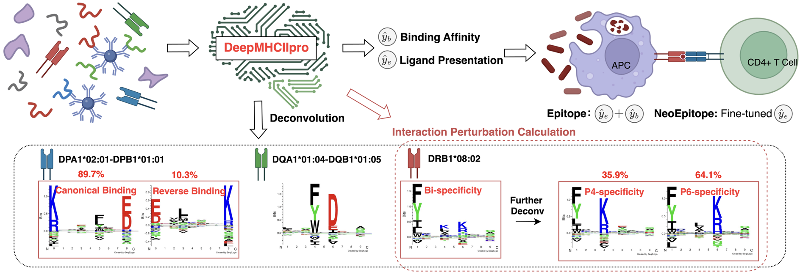
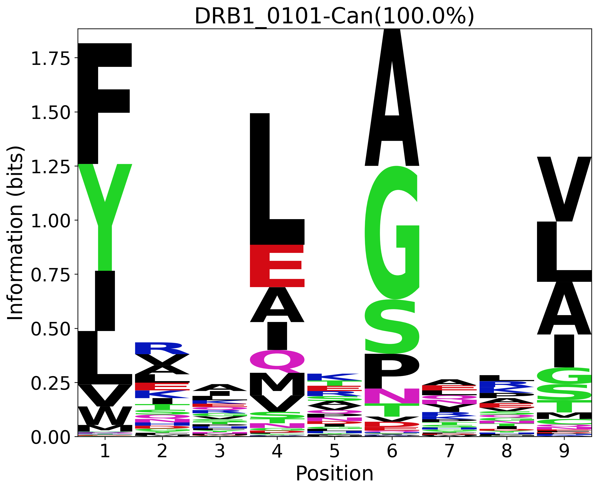
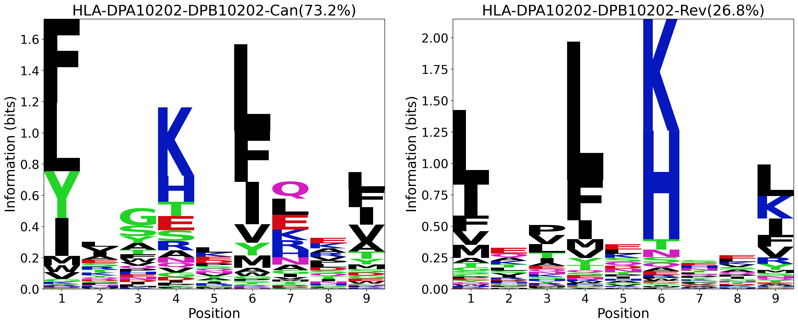
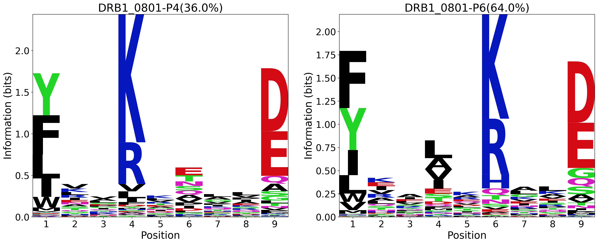
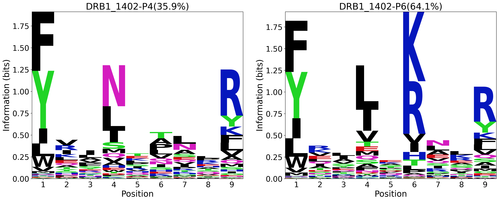

# DeepMHCIIpro
DeepMHCIIpro is a high-performance structure-aware deep interaction model reveals reverse binding and bi-specificity in MHC-II antigen presentation
<!-- a versatile deep interaction model for MHC-II antigen presentation prediction improvement and extensive MHC-II specificity disclosure including reverse binding and bi-specificity. -->



## Installation
###### Pip installation
```bash
pip install deepmhc-1.0.1-py3-none-any.whl
```
###### Source code installation
```bash
git clone https://github.com/lijxgit/DeepMHCIIpro.git
conda create -n DeepMHCIIpro python=3.9.19
conda activate DeepMHCIIpro
python setup.py install
```

## Data and model weights
The following data and model weights are available at [Zenodo](https://doi.org/10.5281/zenodo.15280831).

## Repo contents
```shell
DeepMHCIIpro/
│── configs/         # Configuration files (e.g., model parameters, training settings)
│── bin/             # Executable python directory
│── data/            # Dataset storage and preprocessing scripts (Extract DeepMHCIIpro-data.tar.gz File)
│──── 5cv/           # 5 cross validation data
│──── indep/         # independent data
│──── finetune/      # fine-tuned data
│── deepmhc/         # Core project code and implementation
│──── models/        # weight directory
│──────- mhcii/      # model weight path
│── deepmhcii        # Executable python script
│── README.md        # Project documentation
│── requirements.txt # List of dependencies
```

## Usage

### Commands
###### Single-allele presentation prediction with evaluation
```bash
# No context information 
./deepmhcii -i ./data/indep/SA2023.txt -w PMC -m EL -r \
--evaluation
# Use context information
./deepmhcii -i ./data/indep/SA2023.txt -w PMC -m EL -r -c \
--evaluation
```
###### Multi-allele antigen presentation prediction with evaluation
```bash
# No context information 
./deepmhcii -i ./data/indep/MA2024.txt -w PMC -m EL -r \
--evaluation
# Use context information
./deepmhcii -i ./data/indep/MA2024.txt -w PMC -m EL -r -c \
--evaluation
```
###### Microbial antigen presentation prediction with evaluation
```bash
./deepmhcii -i ./data/indep/MBL2023.txt -w PMC -m EL -r --verbose
```
###### CD4+ T cell epitope prediction with evaluation (SA; artificial negatives)
```bash
./deepmhcii -i ./data/indep/EPI2023.txt -w PMC -m Epi -r --verbose \
--evaluation
```
###### Immunogenicity test prediction with evaluation (SA; natural negatives)
```bash
./deepmhcii -i ./data/finetune/immun_test.txt -w PMC-Immu -m EL -r --verbose \
--evaluation

./deepmhcii -i ./data/finetune/immun_test.txt -w PMC -m EL -r --verbose \
--evaluation
```
###### Neoepitope immunogenicity prediction with evaluation (MA; artificial negatives)
```bash
./deepmhcii -i ./data/indep/NEO2019.15.txt -w PMC-Immu -m EL -r --max-pool --verbose \
--evaluation

./deepmhcii -i ./data/indep/NEO2019.15.txt -w PMC -m Epi -r --max-pool --verbose \
--evaluation
```
Since our model was fine-tuned only on single-allele immunogenic data, so we 
utilize max-pooling method to handle MA immunogenic test data.
###### Generate sequence logos for MHC-II specificity (motif preference)
```bash
# Single Specificity
./deepmhcii -i ./data/random/seq2logo.txt -w PMC -m EL -a DRB1_0101 --motif "./figures/DRB1_0101.png"
# Canonical and Reverse Binding Speficity
./deepmhcii -i ./data/random/seq2logo.txt -w PMC -m EL -r -a HLA-DPA10202-DPB10202 --motif "./figures/DPA10202_DPB10202.png"
# P4-speficity and P6-speficity in Bi-speficity -> Electron / Hydorgen Bond
./deepmhcii -i ./data/random/seq2logo.txt -w PMC -m EL -r -a DRB1_0801 --motif "./figures/DRB1_0801.png" --mask B28
./deepmhcii -i ./data/random/seq2logo.txt -w PMC -m EL -r -a DRB1_1402 --motif "./figures/DRB1_1402.png" --mask B13
```
<p align="center">
  
  
  
  
</p>


### Required arguments
* ```-i <file>``` or  ```--input <file>```: input file path
* `-o <file>` or `--output <file>`: output file path
* `-m <BA|EL|Epi>` or `--mode <BA|EL|Epi>`: scoring output mode 
Choose a scoring output among binding affinity, ligand presentation and epitope identification
* `-w <weight>` or `--weight_name <weight>`: model weight name
* `-a <alleles>` or `--alleles <alleles>`: allele name
Specify allele name and allow multiple alleles, seperated by commas

### Optional arguments
* `-c` or `--context`: Whether to use context information
* `-r` or `--reverse`: Whether to consider the reverse binding mode
* `--motif`: Save path for generated sequence motif
* `--mask`: Specify the masked interaction pair, such as P6-B28
* `--sort`: Whether to sort the output scores
* `--max-pool`: Whether to use max-pooling or attention-based MIL
* `--verbose`: Whether to print output
* `--advanced`: Whether to display score of each allele for multi-allele samples
* `--evaluation`: Whether to evaluate model performance on benchmark datasets
* `-s` or `--start-id`: Start id of 25 models for ensemble
* `-n` or `--num_models`: End id of 25 models for ensemble

### Output formation
* `Num`: Line number
* `Cell_Line`: MHC combination
* `Peptide`: Peptide sequence
* `Best_Allele`: The best allele
* `Bind_Core`: Binding core of 9-length
* `Bind_Mode`: Canonical and reverse binding mode
* `Score_EL`: Presentation prediction
* `%Rank_EL`: Ranking percentage output
* `Bi-Spec`: Bi-specificity
* `Allele_Names`: Each allele name
* `Allele_EL_Scores`: Each allele score for presentation

## Acknowledgements
DeepMHCIIpro uses the following separate libraries and packages: 
*   [Logomaker](https://github.com/jbkinney/logomaker), [Torch](https://pytorch.org/), [NumPy](https://github.com/numpy/numpy), [tqdm](https://github.com/tqdm/tqdm),  [Click](https://github.com/pallets/click/), [scipy](https://github.com/scipy/scipy), [scikit-learn](https://github.com/scikit-learn/scikit-learn), [pathlib](https://docs.python.org/3/library/pathlib.html), [ruamel.yaml](https://yaml.dev/doc/ruamel.yaml/), [logzero](https://github.com/metachris/logzero)

We thank all their contributors and maintainers! 
Also thank the developers of [Seq2logo](https://services.healthtech.dtu.dk/services/Seq2Logo-2.0/) that we use to generate motifs in paper.

## Declaration
It is free for non-commercial use. For commercial use, please contact 
Mr. Jinxing Li and Prof. Shanfeng Zhu (zhusf@fudan.edu.cn).

